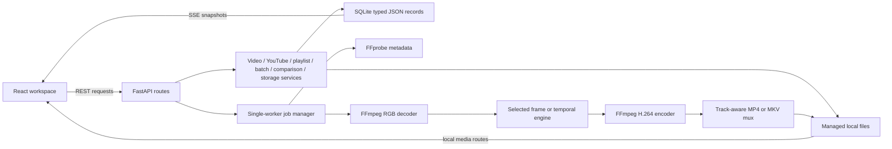

# OhIc Developer README

This is the complete technical guide for setting up, configuring, running, testing, debugging,
and extending OhIc. For product features and user instructions, start with the
[consumer README](README.md).

## Contents

- [Technical overview](#technical-overview)
- [Repository layout](#repository-layout)
- [Setup from a fresh clone](#setup-from-a-fresh-clone)
- [Running OhIc](#running-ohic)
- [Configuration reference](#configuration-reference)
- [User-selectable processing settings](#user-selectable-processing-settings)
- [Architecture and data flow](#architecture-and-data-flow)
- [Persistence and local files](#persistence-and-local-files)
- [API reference](#api-reference)
- [Processing pipeline](#processing-pipeline)
- [YouTube and playlist implementation](#youtube-and-playlist-implementation)
- [Watch-while-enhancing implementation](#watch-while-enhancing-implementation)
- [Concurrency, cancellation, and restart behavior](#concurrency-cancellation-and-restart-behavior)
- [Security and privacy boundaries](#security-and-privacy-boundaries)
- [Testing and quality checks](#testing-and-quality-checks)
- [Benchmarking](#benchmarking)
- [Docker](#docker)
- [Troubleshooting](#troubleshooting)
- [Extension guide](#extension-guide)
- [Known technical limitations](#known-technical-limitations)

## Technical overview

OhIc has two local processes:

| Layer | Implementation | Default address | Responsibility |
| --- | --- | --- | --- |
| Browser workspace | React 19, TypeScript, vinext, Vite | `http://localhost:3000` | Import, settings, progress, history, playlists, storage, playback, comparison |
| Local engine | Python 3.11/3.12, FastAPI, Pydantic, Uvicorn | `http://127.0.0.1:8000` | Validation, FFprobe, yt-dlp, SQLite, job orchestration, AI inference, FFmpeg, media delivery |

The production enhancement model is the official Real-ESRGAN ×2 RRDBNet checkpoint, loaded
directly through PyTorch. Hardware selection is automatic in this order:

1. Metal Performance Shaders (`mps`)
2. NVIDIA CUDA (`cuda`)
3. CPU (`cpu`)

Video frames are streamed from FFmpeg to Python and back to FFmpeg. A complete decoded video is
never accumulated in memory. SQLite stores typed JSON records and filesystem paths; media bytes
stay in the configured data directory.

## Repository layout

```text
OhIc/
├── app/                         # React workspace and UI components
│   ├── components/              # Source, setup, progress, result, history, playlist, storage UI
│   └── lib/                     # Frontend API client and TypeScript contracts
├── backend/
│   ├── app/
│   │   ├── api/                 # FastAPI routes and dependency accessors
│   │   ├── core/                # Settings, logging, hardware detection
│   │   ├── inference/           # Model interface, registry, RRDBNet, weights
│   │   ├── jobs/                # Single-worker manager and FFmpeg/model pipelines
│   │   ├── models/              # SQLite persistence adapter
│   │   ├── schemas/             # Pydantic request, response, and persisted types
│   │   ├── services/            # Videos, YouTube, downloads, playlists, storage
│   │   ├── utils/               # Filename, URL, and path validation
│   │   └── video/               # FFprobe parsing and resolution recommendations
│   ├── tests/                   # Backend unit, integration, and opt-in network tests
│   ├── pyproject.toml           # Python package and tool configuration
│   └── uv.lock                  # Reproducible Python dependency lock
├── data/                        # Runtime data; ignored by Git
├── docs/                        # Supporting architecture and model notes
├── public/                      # Static frontend assets
├── scripts/                     # Setup, development, and production-style launchers
├── tests/                       # Frontend/build tests
├── .env.example                 # Complete environment template
├── Dockerfile                   # Backend-only Linux/CPU image
├── Makefile                     # Common commands
└── package.json                 # Frontend dependencies and scripts
```

## Setup from a fresh clone

### Consumer one-command installation

The root `install.sh` is both an installer and a production launcher. On macOS and Linux it can be
run without cloning the repository first:

```bash
curl -fsSL https://raw.githubusercontent.com/ravi0531rp/OhIc/main/install.sh | bash
```

It downloads a release into the platform user-data directory, provisions uv and a private Node 22
runtime when necessary, installs FFmpeg through Homebrew or a supported Linux package manager,
creates the Python environment, runs `npm ci`, builds the production frontend, verifies the backend
import, installs `~/.local/bin/ohic`, and launches both localhost services. Application data lives
outside versioned releases, so `ohic --update` does not overwrite videos, jobs, presets, or model
weights.

Useful noninteractive and diagnostic modes:

```bash
./install.sh --install-only
./install.sh --no-open
./install.sh --doctor
OHIC_HOME=/custom/location ./install.sh --install-only
```

The script is intentionally limited to macOS and Linux. System FFmpeg installation can require
administrator approval; all other managed tools are installed under `OHIC_HOME` or the current
user's binary directory.

### 1. Choose a supported environment

- **macOS 13+:** supported with PyTorch MPS acceleration when available and CPU fallback.
- **Linux:** supported for CPU and NVIDIA CUDA development. Install a PyTorch/CUDA combination
  appropriate for the host if the lockfile's resolved wheel is not CUDA-enabled.
- **Windows:** not a documented native target for the Bash scripts. WSL2 can follow the Linux
  path, but GPU passthrough and media codecs are environment-specific.

### 2. Install system prerequisites

Required versions:

| Dependency | Requirement | Purpose |
| --- | --- | --- |
| Git | Current stable | Clone and contribute |
| Python | `>=3.11,<3.13` | Backend runtime |
| uv | Current stable | Python selection, lock, virtual environment, commands |
| Node.js | `>=22.13.0` | Frontend and yt-dlp JavaScript challenge runtime |
| npm | Bundled with Node | Frontend dependency install and scripts |
| FFmpeg + FFprobe | Current stable | Inspect, decode, encode, mux, and verify video |

macOS with Homebrew:

```bash
xcode-select --install
brew install git ffmpeg uv node
```

Ubuntu/Debian:

```bash
sudo apt-get update
sudo apt-get install -y git curl ffmpeg
curl -LsSf https://astral.sh/uv/install.sh | sh
```

Install Node 22.13+ with your preferred Node version manager or the official Node distribution.
For example, with `nvm`:

```bash
nvm install 22
nvm use 22
```

Verify every tool before continuing:

```bash
git --version
uv --version
python3 --version
node --version
npm --version
ffmpeg -version
ffprobe -version
```

`uv` can provision the compatible Python interpreter used by the backend; the system `python3`
version does not have to be the final virtual-environment interpreter.

### 3. Clone the repository

```bash
git clone https://github.com/ravi0531rp/OhIc.git
cd OhIc
```

All commands below assume the repository root is the current directory.

### 4. Install backend and frontend dependencies

The setup script validates the required executables, resolves the backend with the development
dependency group, installs frontend packages, and creates runtime directories:

```bash
./scripts/setup.sh
```

Equivalent manual commands:

```bash
cd backend
uv sync --frozen --group dev
cd ..
npm ci
mkdir -p data/uploads data/downloads data/jobs data/outputs data/models data/temp
```

Use `uv sync --group dev` instead of `--frozen` only when intentionally refreshing or editing the
Python lockfile. Use `npm install` instead of `npm ci` only when intentionally updating the npm
lockfile.

### 5. Configure the environment

No environment file is required for the default localhost setup. To override anything:

```bash
cp .env.example .env
```

Edit `.env`, then review [Configuration reference](#configuration-reference). Backend settings
are loaded with the `OHIC_` prefix. The backend searches `../.env` and `.env` relative to a normal
launch from `backend/`, so the root `.env` used above is found.

### 6. Start development mode

```bash
./scripts/dev.sh
```

This starts Uvicorn with Python reload on `127.0.0.1:8000`, then vinext/Vite on port 3000. The
script terminates the backend when the frontend process exits.

Verify the installation:

```bash
curl http://127.0.0.1:8000/api/health
```

Then open:

- Workspace: [http://localhost:3000](http://localhost:3000)
- OpenAPI UI: [http://127.0.0.1:8000/docs](http://127.0.0.1:8000/docs)
- Raw OpenAPI document: [http://127.0.0.1:8000/openapi.json](http://127.0.0.1:8000/openapi.json)

### 7. Run the verification suite

In a second terminal:

```bash
make lint
make test
make build
```

The first production-model enhancement needs outbound access to GitHub Releases. It downloads the
official checkpoint into `data/models/`. Normal tests do not download this model.

## Running OhIc

### Development mode

```bash
make dev
# or ./scripts/dev.sh
```

- Backend reload is enabled.
- Frontend hot module replacement is enabled.
- Both ports are fixed by the script at 8000 and 3000.

### Production-style local mode

```bash
make start
# or ./scripts/start.sh
```

The launcher starts Uvicorn without reload, builds the frontend if `dist/` does not exist, and
runs the vinext production server. Delete `dist/` or run `npm run build` after frontend changes;
the launcher only checks whether the directory exists, not whether it is current.

### Run processes manually

Manual startup is useful for separate logs or non-default ports.

Backend:

```bash
cd backend
uv run uvicorn app.main:app --host 127.0.0.1 --port 8000
```

Frontend, from another terminal at the repository root:

```bash
npm run dev
```

For a different backend port, keep all three values consistent:

```dotenv
OHIC_PORT=9000
NEXT_PUBLIC_API_URL=http://localhost:9000
OHIC_FRONTEND_ORIGIN=http://localhost:3000
```

Then explicitly pass the port to Uvicorn because the provided scripts hard-code `8000`:

```bash
cd backend
uv run uvicorn app.main:app --host 127.0.0.1 --port 9000
```

`python -m app.main` reads `OHIC_HOST` and `OHIC_PORT` directly, but the Uvicorn command is the
standard project path.

### Make targets

| Command | Expansion |
| --- | --- |
| `make setup` | `./scripts/setup.sh` |
| `make dev` | `./scripts/dev.sh` |
| `make build` | `npm run build` |
| `make start` | `./scripts/start.sh` |
| `make test` | Backend pytest, then frontend build/tests |
| `make lint` | Ruff, ESLint, and TypeScript typecheck |
| `make benchmark` | Real-ESRGAN ×2 local benchmark; may download weights |

## Configuration reference

Copy `.env.example` to `.env`. Every application setting is listed below.

### Backend settings

| Variable | Type | Default | Effect |
| --- | --- | --- | --- |
| `OHIC_APP_NAME` | string | `OhIc` | Settings-level application label. FastAPI's displayed title is currently fixed separately as `OhIc Local API`. |
| `OHIC_HOST` | IP/hostname | `127.0.0.1` | Bind address used by `python -m app.main`. The bundled shell scripts pass `127.0.0.1` directly and therefore override it. Use `0.0.0.0` only when intentionally exposing the API to the network. |
| `OHIC_PORT` | integer | `8000` | Port used by `python -m app.main`. Bundled shell scripts pass `8000` directly; update the manual Uvicorn command and frontend API URL for another port. |
| `OHIC_FRONTEND_ORIGIN` | URL origin | `http://localhost:3000` | Additional browser origin allowed by FastAPI CORS. `http://127.0.0.1:3000` is always also allowed. Supply an origin only—no path or trailing wildcard. |
| `OHIC_DATA_DIR` | filesystem path | repository `data/` | Root for uploads, downloads, outputs, temporary job data, and `ohic.sqlite3`. Relative paths resolve from the backend process's working directory. Restart after changing it. |
| `OHIC_MODEL_DIR` | filesystem path or unset | `${OHIC_DATA_DIR}/models` | Model-weight cache. If unset, the backend derives it from `OHIC_DATA_DIR`. |
| `OHIC_MAX_UPLOAD_GB` | positive number | `20` | Maximum streamed local upload size in GiB. The service reads 4 MiB chunks and deletes the partial file if the limit is crossed. This does not limit YouTube downloads or outputs. |
| `OHIC_STALE_TEMP_HOURS` | integer hours | `24` | On backend startup, files and directories directly under `data/temp` older than this age are removed. Completed outputs and stream parts are not affected. |
| `OHIC_CHECKPOINT_SECONDS` | seconds, 5–300 | `30` | Durable segment length for full-video pause/resume checkpoints. Smaller values reduce lost work but create more intermediate files and concat entries. |
| `OHIC_YOUTUBE_COOKIES_FILE` | filesystem path or unset | unset | Optional Netscape-format cookies file passed to yt-dlp for content the configured account may access. The path and cookie contents are never returned by the API. Restart after changing it. |
| `OHIC_DEFAULT_MODEL` | model ID | `realesrgan-x2plus` | Reserved pipeline default. Current UI/API requests explicitly default `model_id` to `realesrgan-x2plus`; changing only this variable does not change submitted jobs yet. |
| `OHIC_DEFAULT_CODEC` | codec ID | `h264` | Reserved codec default. The current encoder is explicitly `libx264` with MP4 output; changing only this variable has no effect yet. |
| `OHIC_ENABLE_REALBASICVSR` | boolean | `true` | Registers the experimental `realbasicvsr-x4-experimental` engine in `/api/models` and the UI. Set `false` and restart to expose only Real-ESRGAN. This does not delete cached weights or prior job records. |
| `OHIC_LOG_LEVEL` | log level | `INFO` | Python/structlog filtering. Typical values are `DEBUG`, `INFO`, `WARNING`, `ERROR`, and `CRITICAL`. Unknown values fall back to `INFO`. Logs are JSON after application startup. |

The settings model ignores unknown environment fields. Directories are created during settings
initialization. If `OHIC_MODEL_DIR` is blank rather than omitted, validate the parsed path before
relying on it; omitting it is the supported way to select the derived default.

### Frontend setting

| Variable | Type | Default | Effect |
| --- | --- | --- | --- |
| `NEXT_PUBLIC_API_URL` | absolute URL | `http://localhost:8000` | Base URL used by REST, SSE, and media requests. It is embedded into the frontend build/runtime bundle, so restart development mode or rebuild after changing it. Do not add `/api` or a trailing endpoint. |

### Test-only switches

These are opt-in and are not normal runtime configuration:

| Variable | Value to enable | Effect |
| --- | --- | --- |
| `OHIC_RUN_NETWORK_TESTS` | `1` | Enables the small live YouTube ingestion test. It uses the public network and can fail when YouTube behavior changes. |
| `OHIC_RUN_LARGE_YOUTUBE_TESTS` | `1` | Enables the larger live regression test for YouTube format fallback. It downloads substantially more data. |

### Configuration precedence and caching

Pydantic Settings reads process environment and `.env`, using the `OHIC_` prefix. Process
environment values take precedence. `get_settings()` is cached for the process lifetime, so
restart the backend after changing configuration. Frontend public environment values also require
a restart or rebuild.

## User-selectable processing settings

These are submitted with jobs rather than read from `.env`.

### Output resolution

Targets preserve aspect ratio and force an even width for H.264 compatibility:

| Source height | Offered target heights | Recommended |
| --- | --- | --- |
| `< 400` | 720, 1080, 1440 | 720 |
| `400–599` | 720, 1080, 1440 | 1080 |
| `600–899` | 1080, 1440, 2160 | 1080 |
| `900–1299` | 1440, 2160 | 1440 |
| `1300–1899` | 2160 | 2160 |
| `>= 1900` | source height | source height |

The API accepts at most 7680×4320, requires positive even dimensions, and rejects a target that
deviates by more than four pixels from the source aspect ratio.

### Quality preset

The preset changes inference tile size and x264's speed/quality settings:

| Preset | GPU/MPS tile | CPU tile | x264 preset | CRF | Intended use |
| --- | ---: | ---: | --- | ---: | --- |
| `fast` | 512 | 192 | `veryfast` | 21 | Quick checks and long videos |
| `balanced` | 384 | 160 | `medium` | 19 | Default detail/time tradeoff |
| `maximum` | 256 | 128 | `slow` | 17 | Slowest, finer tile pass and less lossy encode |

Real-ESRGAN has a 12-pixel tile overlap. If PyTorch reports an allocation/memory failure, the
active tile size is halved once, with a minimum of 64 pixels. A smaller inference tile primarily
reduces peak memory; the x264 preset/CRF also makes Maximum slower and larger than Fast.

### Job kind

| Value | Behavior |
| --- | --- |
| `preview` | Enhances up to five seconds centered on `preview_timestamp`, clamped to source bounds, and creates a matching original clip. |
| `full` | Enhances the complete source unless `trim_start`/`trim_end` selects a range. |
| `stream` | Uses the same selected range but publishes independent enhanced parts before joining the final result. |

### Range and preview values

- `preview_timestamp`: seconds from source start; minimum 0. It affects preview jobs only.
- `trim_start`: seconds from source start; minimum 0.
- `trim_end`: optional end in seconds; must be greater than 0. Omission means source duration.
- The effective end is clamped to the source duration.
- Start must be before source end and the effective selection must be at least 0.1 seconds.
- Full and stream jobs store the selected range in their job record, so reopening History restores
  the controls.

### Model selection

`model_id` defaults to `realesrgan-x2plus`. The registry rejects unknown IDs. When
`OHIC_ENABLE_REALBASICVSR=true`, `realbasicvsr-x4-experimental` is also available for preview and
full/range jobs. Its capability metadata rejects stream jobs and inputs above 1280×720 before the
job enters the queue. The interpolation adapter `lanczos-test` is instantiated only by explicit
test/benchmark registries and is not available through the production API.

### Scan, container, track, resource, and scene settings

Every `JobCreate` also accepts these persisted fields:

| Field | Values/default | Effect |
| --- | --- | --- |
| `output_container` | `mp4` (default), `mkv` | Result suffix/container. Stream jobs require MP4. |
| `track_policy` | `compatible` (default), `preserve` | Compatible MP4 maps all audio and AAC-encodes it. Preserve+MKV also stream-copies subtitles, attachments, and data tracks. |
| `preserve_metadata` | `true` | Maps source container/stream metadata during final mux. |
| `preserve_chapters` | `true` | Maps source chapters during final mux. |
| `scan_treatment` | `auto` (default), `off`, `deinterlace`, `ivtc` | Auto applies `bwdif` only when FFprobe reports interlacing. Explicit deinterlace applies `bwdif` to all frames. IVTC uses `fieldmatch,bwdif,decimate` and is rejected outside 29–31 FPS. |
| `resource_policy` | `auto` (default), `conservative`, `performance` | Selects pressure-aware inference tile and temporal-window bounds. |
| `memory_limit_mb` | unset or >=512 | Caps the memory budget used by the resource planner; it is not an OS-level hard limit. |
| `scene_aware` | `true` | Resets RealBasicVSR context at detected hard cuts. Frame engines ignore it. |
| `scene_threshold` | `0.35`, range 0.1–0.9 | Hard-cut sensitivity for sparse luma/histogram comparison; lower detects more cuts. |

Full jobs persist a source fingerprint, settings signature, segment plan, status, output name, and
SHA-256 for every completed checkpoint. Changing a source file invalidates resume. Preview jobs
restart from the beginning; stream jobs reuse persisted ready parts.

## Architecture and data flow



### Frontend

- `app/OhIcApp.tsx` owns navigation and active source/job state.
- `app/lib/api.ts` is the REST/SSE base URL boundary.
- An `EventSource` follows active jobs; on connection failure, the UI polls the job and reconnects.
- Opening History retrieves the latest job and its source, then reconstructs the workspace or
  result from persisted fields.
- Native `<video>` elements handle source, comparison, result, and stream-part playback. The app
  does not load complete videos into JavaScript memory.

### Backend boundaries

- Routes validate transport models and translate expected failures into HTTP responses.
- Services own source ingestion, YouTube behavior, playlist workflows, and storage cascades.
- `JobManager` owns scheduling, runtime cancellation, persisted progress, and terminal state.
- Pipeline modules own FFmpeg commands and frame/model processing.
- Model adapters own weight lifecycle, architecture, inference, and device support.

## Persistence and local files

Default layout:

```text
data/
├── uploads/                     # UUID-named copies of local uploads
├── downloads/                   # yt-dlp files and temporary fragments
├── models/                      # RealESRGAN_x2plus.pth
├── outputs/                     # previews, MP4/MKV results, durable checkpoints, stream parts
├── temp/                        # transient per-job FFmpeg logs/workspaces
├── jobs/                        # reserved runtime directory
└── ohic.sqlite3                 # records and paths, not video blobs
```

SQLite uses WAL mode and six typed-JSON tables:

| Table | Columns outside JSON | JSON payload |
| --- | --- | --- |
| `videos` | `id`, `created_at` | Source type, original name, managed path, metadata, targets, playback URL, optional YouTube display metadata |
| `jobs` | `id`, `video_id`, `status`, `created_at` | Complete job settings, progress, stream plan, timestamps, output path/URLs, errors |
| `playlists` | `id`, `created_at`, `updated_at` | Playlist display data, preset, overall state, and every item state/reference |
| `batches` | `id`, `created_at`, `updated_at` | Persistent local multi-file queue and child job references |
| `presets` | `id`, `created_at` | Named target, engine, quality, container, scan, resource, and scene settings |
| `comparisons` | `id`, `created_at`, `updated_at` | Preview Lab variants, child jobs, progress, and output URLs |

The Pydantic response model excludes source `path` and job `output_path`, but persistence explicitly
adds them to stored JSON. API media routes resolve the stored record and verify the requested file
is still inside the configured data or output directory.

Storage cleanup accepts identifiers in `video:<uuid>` and `job:<uuid>` form. Deleting a video
cascades through its linked job records and their output/original/stream files. Deleting a job
removes only that job's managed outputs. Active records are rejected. Playlist records are not
implicitly deleted; their completed items reconcile to `removed` if linked records disappear.

Temporary directories older than `OHIC_STALE_TEMP_HOURS` are removed during backend startup.
Per-job temporary directories are removed in pipeline `finally` blocks.

## API reference

Interactive schemas are always available at `/docs`. All application routes are under `/api`.

### Endpoint summary

| Method | Path | Purpose | Success |
| --- | --- | --- | --- |
| `GET` | `/api/health` | FFmpeg/FFprobe status and detected hardware | 200 |
| `GET` | `/api/system/resources` | Current memory pressure, available memory, CPU count, and load | 200 |
| `GET` | `/api/models` | Enabled engine metadata and capabilities | 200 |
| `POST` | `/api/videos/upload` | Multipart video ingestion (`file`) | 200 |
| `POST` | `/api/videos/upload/batch` | Ingest 1–100 multipart videos (`files`) | 200 |
| `GET` | `/api/videos/{video_id}` | Persisted source record | 200 |
| `GET` | `/api/videos/{video_id}/media` | Local source media | 200 |
| `POST` | `/api/videos/youtube/inspect` | Inspect one YouTube video | 200 |
| `GET` | `/api/videos/youtube/reliability` | Local yt-dlp/Node/cookies/PO-provider diagnostics | 200 |
| `POST` | `/api/videos/youtube/download` | Queue one YouTube download | 202 |
| `GET` | `/api/videos/youtube/downloads/{id}` | Download snapshot | 200 |
| `POST` | `/api/videos/youtube/downloads/{id}/cancel` | Stop queued/active download | 200 |
| `GET` | `/api/videos/youtube/downloads/{id}/events` | Download SSE stream | 200 |
| `POST` | `/api/playlists/inspect` | Inspect up to 100 playlist items | 200 |
| `POST` | `/api/playlists` | Persist and start selected playlist items | 202 |
| `GET` | `/api/playlists?limit=50` | List 1–100 saved playlists | 200 |
| `GET` | `/api/playlists/{id}` | Playlist snapshot | 200 |
| `POST` | `/api/playlists/{id}/cancel` | Stop playlist and active child job | 200 |
| `DELETE` | `/api/playlists/{id}` | Remove a non-active playlist record | 204 |
| `GET` | `/api/playlists/{id}/events` | Playlist SSE stream | 200 |
| `POST` | `/api/jobs` | Queue preview/full/stream enhancement | 202 |
| `GET` | `/api/jobs?limit=20` | List 1–100 recent jobs | 200 |
| `GET` | `/api/jobs/{id}` | Job snapshot | 200 |
| `POST` | `/api/jobs/{id}/cancel` | Stop queued/active job | 200 |
| `POST` | `/api/jobs/{id}/pause` | Request a checkpoint-safe pause | 200 |
| `POST` | `/api/jobs/{id}/resume` | Resume paused/recoverable failed work | 200 |
| `GET` | `/api/jobs/{id}/events` | Job SSE stream | 200 |
| `GET` | `/api/jobs/{id}/stream/{index}` | Ready stream part; 425 while not ready | 200 |
| `GET` | `/api/jobs/{id}/result` | Completed enhanced MP4 or MKV | 200 |
| `GET` | `/api/jobs/{id}/original` | Completed preview/range original MP4 | 200 |
| `GET` | `/api/storage/items` | Managed sources and outputs | 200 |
| `POST` | `/api/storage/cleanup` | Delete selected inactive records/files | 200 |
| `GET`,`POST` | `/api/presets` | List/create named local presets | 200/201 |
| `DELETE` | `/api/presets/{id}` | Delete one preset | 204 |
| `GET`,`POST` | `/api/batches`, `/api/batches` | List/create persistent local batches | 200/202 |
| `POST` | `/api/batches/{id}/{pause,resume,cancel}` | Group control for child jobs | 200 |
| `GET`,`POST` | `/api/comparisons`, `/api/comparisons` | List/create Preview Lab sessions | 200/202 |
| `GET` | `/api/comparisons/{id}` | Refresh one comparison session | 200 |
| `POST` | `/api/comparisons/{id}/cancel` | Stop comparison child jobs | 200 |

SSE endpoints emit named `progress` events containing the full current JSON record and send
comment keep-alives. Job/playlist intervals are 0.5 seconds; download intervals are 0.35 seconds.
The stream closes after a terminal state.

### Core request examples

Inspect a YouTube video:

```bash
curl -X POST http://127.0.0.1:8000/api/videos/youtube/inspect \
  -H 'Content-Type: application/json' \
  -d '{"url":"https://www.youtube.com/watch?v=VIDEO_ID"}'
```

Upload a local video:

```bash
curl -F 'file=@/absolute/path/to/video.mp4' \
  http://127.0.0.1:8000/api/videos/upload
```

Create an enhancement:

```bash
curl -X POST http://127.0.0.1:8000/api/jobs \
  -H 'Content-Type: application/json' \
  -d '{
    "video_id":"VIDEO_UUID",
    "kind":"full",
    "target_width":1920,
    "target_height":1080,
    "preset":"balanced",
    "model_id":"realesrgan-x2plus",
    "preview_timestamp":30,
    "trim_start":0,
    "trim_end":null
  }'
```

Create a selected playlist:

```bash
curl -X POST http://127.0.0.1:8000/api/playlists \
  -H 'Content-Type: application/json' \
  -d '{
    "url":"https://www.youtube.com/playlist?list=PLAYLIST_ID",
    "selected_video_ids":["YOUTUBE_ID_1","YOUTUBE_ID_2"],
    "preset":"balanced"
  }'
```

Delete selected managed items:

```bash
curl -X POST http://127.0.0.1:8000/api/storage/cleanup \
  -H 'Content-Type: application/json' \
  -d '{"ids":["video:VIDEO_UUID","job:JOB_UUID"]}'
```

### Important response fields

`VideoRecord` includes `id`, `source_type`, `original_name`, `metadata`, `targets`, `created_at`,
`playback_url`, and optional `title`, `thumbnail`, and `uploader`. `VideoMetadata` includes width,
height, display label, aspect ratio, FPS, frame count, duration, video/audio codecs, bitrate, file
size, pixel format, and detected dynamic range.

`JobRecord` includes all submitted settings plus `status`, `progress`, lifecycle timestamps,
optional stream state, result/original URLs, error, and processing duration. Status is one of
`queued`, `preparing`, `processing`, `encoding`, `complete`, `failed`, or `cancelled`.

`JobProgress` includes `stage`, `percent`, `frames_done`, optional `frames_total`, optional
`processing_fps`, `elapsed_seconds`, optional `eta_seconds`, and optional detail.

Download status is `queued`, `downloading`, `processing`, `complete`, `failed`, or `cancelled`.
Its progress includes stage, percentage, downloaded/total bytes, bytes-per-second speed, seconds
ETA, and fallback attempt number. Download records live in memory and are not restored on backend
restart; the registered `VideoRecord` is persisted after completion.

Playlist status is `queued`, `running`, `complete`, `partial`, `failed`, or `cancelled`. Item
status is `queued`, `downloading`, `enhancing`, `complete`, `failed`, `cancelled`, or `removed`.

### Media error semantics

- 404: record or completed result is not available.
- 410: record exists but its managed local file has been removed.
- 425: a requested watch-while-enhancing part exists in the plan but is not ready.
- 409: an active playlist must be stopped before deleting its record.
- 400: validation, unsupported input, active-storage deletion, probe, or expected YouTube failure.

## Processing pipeline

### Source ingestion and inspection

- Local filenames are reduced to their basename and limited to `.mp4`, `.mov`, `.mkv`, `.avi`,
  `.webm`, and `.m4v`.
- Local uploads are copied in 4 MiB chunks to a UUID path and are deleted if upload or probe fails.
- FFprobe runs with a 60-second timeout and parses the first video/audio streams plus container
  data.
- Frame count falls back to rounded duration × FPS when the stream does not report `nb_frames`.
- PQ (`smpte2084`) and HLG (`arib-std-b67`) transfer characteristics are labeled HDR; all other
  inputs are labeled SDR.

### Model and weights

- Production ID: `realesrgan-x2plus`
- Display name: Real-ESRGAN ×2
- Checkpoint: `RealESRGAN_x2plus.pth`
- Architecture: local checkpoint-compatible RRDBNet, scale 2, 23 RRDB blocks
- Upstream model license: BSD-3-Clause
- Supported devices: MPS, CUDA, CPU

The weight manager reuses an existing file larger than 1,000,000 bytes. Otherwise it streams the
official GitHub Release with a 120-second HTTP timeout into a `.part` file, verifies a minimum
size and an optional model-specific SHA-256, and atomically replaces the destination. Model
loading looks for `params_ema`, then `params`, then the checkpoint root, and performs strict
state-dict validation. A validation failure deletes the cached checkpoint so the next job
downloads it again. CUDA uses FP16 inference; MPS and CPU use FP32.

The main branch also registers a sequence-oriented RealBasicVSR ×4 engine
behind `OHIC_ENABLE_REALBASICVSR`. It uses a separate bounded temporal-window pipeline for preview
and full/range jobs. A bounded hard-cut detector combines sparse luma difference and per-channel
histogram distance; a detected cut flushes the current window and prevents temporal overlap from
crossing scenes. Single-frame scenes are duplicated only as model context and emitted once.
Installation, verified device status, window strategy,
checkpoint/license details, limitations, and comparison commands are documented in
[the RealBasicVSR experiment](docs/realbasicvsr-experiment.md).

### Preview/full frame path

1. Determine preview or trim timestamps.
2. For preview and trimmed jobs, encode a browser-compatible original comparison clip.
3. Load or reuse the Real-ESRGAN model on the detected device.
4. FFmpeg decodes the chosen source video stream to `rgb24` raw frames on stdout.
5. Python reads exactly one frame, enhances overlapping tiles, and Lanczos-resizes the ×2 result
   if exact target dimensions differ.
6. Python writes the target-sized `rgb24` frame to a second FFmpeg process.
7. FFmpeg encodes `libx264`, the preset-specific CRF, and `yuv420p` into an intermediate video.
8. A final FFmpeg command maps all source audio, metadata, and chapters into fast-start MP4, or
   stream-copies all compatible source tracks into MKV archive mode.
9. The job record exposes the result only after successful finalization.
10. Partial final/original results and temporary workspaces are removed on failure/cancellation.

Progress reserves approximately 2–12% for preparation/model loading, 12–90% for frames, 94% for
audio, and 99% for finalization. Processing FPS uses exponential smoothing (90% previous value,
10% instantaneous value); ETA is remaining frames divided by smoothed FPS.

## YouTube and playlist implementation

### URL safety

Only HTTP(S) URLs whose parsed hostname is exactly one of these are accepted:

```text
youtube.com
www.youtube.com
m.youtube.com
music.youtube.com
youtu.be
```

Embedded credentials are rejected. URLs are passed to yt-dlp's Python API and are never
interpolated into a shell command.

### Inspection and JavaScript challenges

yt-dlp is configured with Node as its JavaScript runtime. The backend package installs
`yt-dlp[default]`, which includes yt-dlp's supported JavaScript challenge components. Base options
use three extractor retries, three fragment retries, and a 15-second socket timeout.

Single-video inspection uses `noplaylist=true` and `skip_download=true`. Playlist inspection uses
flat entries, stops at 100, and never downloads media.

### Standalone download fallback

Downloads are serialized by a one-worker executor and deduplicated by normalized URL while an
existing record is active. Three strategies are attempted in order:

1. `web_embedded`: best MP4 video + M4A audio, then compatible fallbacks.
2. `web_embedded`: one combined video/audio format.
3. `android_vr`: one combined video/audio format.

The merge container is MP4. Progress hooks update bytes, estimated total, speed, ETA, and attempt.
After at least 2 MiB, a stream below 32 KiB/s with an ETA over 30 minutes is considered unusably
throttled if it persists for 10 seconds; the partial file is removed and the next strategy begins.
Cancellation is checked before attempts and inside progress hooks, and all matching fragments are
deleted. A completed file is probed and persisted as a `VideoRecord`.

`GET /api/videos/youtube/reliability` reports the installed yt-dlp version, Node challenge runtime,
optional configured cookies file, and detected PO-token-provider distribution. Download failures
persist a category (`youtube_attestation`, `authentication_required`, `region_restricted`,
`rate_limited`, `unavailable`, or `extractor_failure`) and recovery steps. A Netscape cookies file
can be supplied through `OHIC_YOUTUBE_COOKIES_FILE`; do not commit it.

### Playlist execution

- Inspection and creation both re-read playlist metadata to validate that every selected YouTube
  ID belongs to the playlist.
- One to 100 IDs are accepted. Duplicate IDs collapse for validation and should not be submitted.
- Playlist projects are persisted before work begins.
- A one-worker playlist executor processes items sequentially.
- Each item downloads through the same fallback service, registers a source, selects the
  recommended resolution, and creates a normal full enhancement job with the playlist ID.
- Download occupies the first 15% of item progress; enhancement maps to the remaining 85%.
- Cancellation stops the current child job and marks queued/downloading work for cancellation.
- A batch is `partial` when at least one item completes but the entire selection does not.
- Deleting a playlist deletes only the playlist record; source and result cleanup remains the
  storage service's responsibility.

## Watch-while-enhancing implementation

`build_stream_state()` computes independent parts from the selected range duration:

| Selected duration | First part | Remaining parts |
| --- | ---: | ---: |
| At least 120 seconds | 120 seconds | 5 seconds maximum |
| At least 60 but under 120 seconds | 60 seconds | 5 seconds maximum |
| Under 60 seconds | 5 seconds maximum | 5 seconds maximum |

The final part is shortened to the selected end when necessary. The persisted
`StreamState.chunk_duration` is the five-second follow-up maximum; the initial duration is
represented by the first chunk's timestamps. This front-loads the playback buffer for longer
selections, then publishes small increments intended to reduce later boundary waits. Parts are
enhanced sequentially through the normal full pipeline, including optional source audio, and
stored as:

```text
data/outputs/<job-id>-chunk-0000.mp4
data/outputs/<job-id>-chunk-0001.mp4
...
```

Ready parts are range-capable `FileResponse` media endpoints. The UI presents them behind one
custom full-duration player: it maps part-local playback time onto a global playhead, preloads the
next ready source, supports seeking across the contiguous ready range, and swaps sources without
exposing part numbers or five-second native timelines. If the playhead reaches the ready edge, the
player pauses and resumes when the persisted stream state publishes more video. Once the final
result is available, the same player uses the joined output. FFmpeg's concat demuxer creates that
`<job-id>.mp4` with stream copy, so no additional video generation is required.

Stream state—including each index, timestamps, state, progress, URL, ready count, and buffered
seconds—is stored inside the job JSON, so the viewer can be reopened. The chunk files remain after
final concat until storage cleanup deletes the job output.

## Concurrency, cancellation, and restart behavior

There are three primary one-worker executors plus persisted orchestration records:

| Executor | Scope | Persistence |
| --- | --- | --- |
| `ohic-enhance` | Preview, full, stream, local-batch, comparison, and playlist child jobs | Job/checkpoint/stream state persists; futures/runtimes are recreated by explicit resume |
| `ohic-youtube` | Standalone YouTube downloads | In-memory download records only; completed video records persist |
| `ohic-playlist` | Playlist orchestration | Playlist/item records persist; executor work does not resume |

These executors can run at the same time. A playlist download can overlap a standalone download,
and non-enhancement work can overlap enhancement. Only enhancement inference itself is globally
serialized by the job executor.

Every live job has cancel and pause `threading.Event` values plus a registry of active FFmpeg
`Popen` processes.
Cancellation sets the event and calls `terminate()` on registered processes. Frame and tile loops
also check the event. Cancelling a queued enhancement marks the persisted job cancelled; when its
future reaches the worker, it exits without processing.

Startup reconciliation changes persisted queued/preparing/processing/encoding jobs to `paused`
with `recovered_after_restart=true`. Explicit resume validates the source fingerprint, recreates a
runtime, and requeues the job. Full jobs verify each segment SHA-256 before reuse; streaming jobs
reuse ready chunk files. A pause terminates active FFmpeg processes only after persisting completed
checkpoint bookkeeping. Cancel remains terminal and Storage can remove checkpoint files.

## Security and privacy boundaries

- The default engine binds only to loopback (`127.0.0.1`).
- CORS allows the configured frontend origin and `http://127.0.0.1:3000`; credentials are disabled.
- No authentication is implemented because the default trust boundary is the local machine. Do
  not bind to a LAN/public interface without adding authentication and reviewing media access.
- Uploads use UUID filenames and a strict extension allowlist.
- YouTube URLs use parsed scheme/hostname validation and reject embedded credentials.
- FFmpeg/FFprobe calls use argument lists, never `shell=True`.
- Returned media paths are resolved and checked under the configured data/output root.
- Uploads are streamed with a configurable size limit rather than buffered as one request body.
- Video bytes are not stored in SQLite and are not sent to a cloud processor.
- Thumbnail URLs are displayed from YouTube, so the browser may request those remote images.
- The official model checkpoint and YouTube metadata/media are the expected outbound network
  dependencies.

## Testing and quality checks

### Backend

```bash
cd backend
uv run ruff check app tests
uv run pytest
```

Coverage includes FFprobe parsing, recommendation thresholds, URL/path/filename safety, SQLite
round trips, registry behavior, job cancellation, playlist lifecycle, storage cascades, stream
planning, YouTube fallback/progress/cancellation, and a synthetic CPU pipeline with AAC audio.

Run one file or test:

```bash
cd backend
uv run pytest tests/test_stream_plan.py
uv run pytest tests/test_smoke_pipeline.py::test_cpu_smoke_pipeline_preserves_audio_and_dimensions
```

Live network tests are deliberately skipped by default:

```bash
cd backend
OHIC_RUN_NETWORK_TESTS=1 uv run pytest -m network tests/test_youtube_live.py
OHIC_RUN_LARGE_YOUTUBE_TESTS=1 uv run pytest -m network tests/test_youtube_live.py
```

The large switch does not implicitly enable the small switch; set both to `1` if running the whole
file and expecting both tests. Live YouTube tests are external-system diagnostics and are not
deterministic CI gates.

### Frontend

```bash
npm run typecheck
npm run lint
npm run build
npm test
```

`npm test` runs a production build first and then Node tests under `tests/*.test.mjs`. A separate
`npm run build` before it is redundant but useful when isolating build failures.

### Full project

```bash
make lint
make test
```

CI uses Ubuntu, Python 3.11, FFmpeg, `uv sync --frozen --group dev`, Node 22, `npm ci`, and the same
lint/build/test commands. CI does not enable live network tests or download Real-ESRGAN weights.

## Benchmarking

Fast CI-safe resize benchmark:

```bash
cd backend
uv run python -m app.benchmark --model lanczos-test
```

Real model benchmark (downloads/loads the checkpoint on first use):

```bash
make benchmark
```

All benchmark arguments:

```text
--model MODEL     default: lanczos-test when invoked directly
--width WIDTH     source width; default: 320
--height HEIGHT   source height; default: 180
--frames FRAMES   number of generated frames; default: 12
```

Example:

```bash
cd backend
uv run python -m app.benchmark \
  --model realesrgan-x2plus --width 640 --height 360 --frames 30
```

The benchmark uses deterministic random RGB input, a fixed 192-pixel inference tile, a ×2 target,
and reports detected device, model, dimensions, frame count, total seconds, and inference FPS. It
does not measure FFmpeg decode/encode or end-to-end video throughput.

## Docker

The Dockerfile is a backend-only Linux/CPU reproducibility path:

```bash
docker build -t ohic-engine .
docker run --rm \
  -p 8000:8000 \
  -v "$PWD/data:/data" \
  ohic-engine
```

It uses Python 3.11 slim, installs FFmpeg and uv, performs a frozen production dependency sync,
sets `OHIC_HOST=0.0.0.0` and `OHIC_DATA_DIR=/data`, exposes port 8000, and starts Uvicorn. The
frontend must run separately on the host:

```bash
npm run dev
```

The backend-only image runs on CPU by default and does not expose host-specific MPS/CUDA
acceleration automatically. Run the backend natively or provide an explicitly configured GPU
container runtime when acceleration is required. For a non-local browser origin, set
`OHIC_FRONTEND_ORIGIN` on the container and `NEXT_PUBLIC_API_URL` for the frontend. Binding port
8000 to non-loopback interfaces exposes an unauthenticated API; apply an appropriate security
layer first.

The `.openai/hosting.json` file configures the frontend build workspace only. A static/cloud
frontend by itself is not a functional OhIc deployment because media processing and managed files
live in the local FastAPI engine.

## Troubleshooting

### Health and dependency diagnosis

```bash
curl -s http://127.0.0.1:8000/api/health
```

Expected top-level status is `ok`. A `degraded` result includes the missing executable and path.
The same response reports `mps`, `cuda`, or `cpu` and a device-class label.

### Port already in use

Inspect the port without terminating anything automatically:

```bash
lsof -nP -iTCP:8000 -sTCP:LISTEN
lsof -nP -iTCP:3000 -sTCP:LISTEN
```

Stop the known stale OhIc process or choose a new port using the manual startup instructions. Keep
`NEXT_PUBLIC_API_URL`, Uvicorn's port, and CORS origin consistent.

### CORS or browser network failures

- Confirm the exact browser origin is `OHIC_FRONTEND_ORIGIN` or `http://127.0.0.1:3000`.
- An origin includes scheme, hostname, and port, but no path.
- Confirm `NEXT_PUBLIC_API_URL` is reachable from the browser, not merely from the backend host.
- Restart/rebuild the frontend after changing a `NEXT_PUBLIC_` value.

### FFmpeg/FFprobe failures

```bash
command -v ffmpeg
command -v ffprobe
ffmpeg -version
ffprobe -version
```

Install or update FFmpeg, restart the backend, and retry. A source can pass extension validation
and still fail if its actual container/codec is corrupt or unsupported by the local FFmpeg build.
Per-job FFmpeg stderr is written under `data/temp/<job-id>/ffmpeg.log` while that workspace exists;
the normal cleanup path removes it after completion/failure, so capture backend logs while
reproducing an issue.

### YouTube inspection/download failures

Refresh only yt-dlp and its lock entry:

```bash
cd backend
uv lock --upgrade-package yt-dlp
uv sync --group dev
uv run pytest tests/test_youtube_service.py tests/test_youtube_downloads.py
OHIC_RUN_NETWORK_TESTS=1 uv run pytest -m network tests/test_youtube_live.py
```

Then restart the backend. A 403 can mean every anonymous playback format was rejected and may
require sign-in, a PO token, or a newer yt-dlp version. Private, age-restricted, members-only,
regional, removed, live, or authentication-dependent videos may remain unavailable. Do not add
cookie/credential support without a separate secrets and threat-model review.

The downloader's socket timeout and slow-stream detector prevent indefinite stalls. Repeated
`Trying another YouTube format` stages indicate fallback is working. Inspect backend JSON logs for
`youtube_download_attempt_failed` and its `reason` field.

### Model download or validation failure

Verify write access and free space in `OHIC_MODEL_DIR`. If the cached file is known to be damaged,
stop the backend and move that one explicit file out of the cache before retrying:

```bash
mv data/models/RealESRGAN_x2plus.pth \
  data/models/RealESRGAN_x2plus.pth.invalid
```

The application also deletes a checkpoint automatically when strict model validation fails. Do
not delete the whole data directory as a model-cache recovery step.

### MPS/CUDA is not selected

Run:

```bash
cd backend
uv run python -c 'import torch; print("mps", torch.backends.mps.is_available()); print("cuda", torch.cuda.is_available())'
```

On macOS, confirm an MPS-capable system, a supported macOS/PyTorch combination, and a native
arm64 Python where applicable.
On Linux, confirm NVIDIA driver, CUDA runtime compatibility, and that the installed PyTorch wheel
includes CUDA. OhIc deliberately falls back to CPU when neither backend reports available.

### Out of memory

The pipeline retries an allocation failure at half tile size once. If that still fails, lower the
target resolution or preset, close GPU-heavy applications, and retry. Maximum uses smaller tiles
but also a slower/higher-quality encode; Balanced or Fast remains the recommended recovery path.

### Stale active jobs after backend restart

Current in-process futures are not durable. A hard restart can leave a persisted active state.
There is no supported resume action for such a job; clean up its inactive files/records once the
engine is stable, then submit a new job. A future startup reconciler should explicitly mark orphaned
active jobs failed or requeue checkpointed work.

### Database inspection

Stop write-heavy work first, then use SQLite read-only queries:

```bash
sqlite3 data/ohic.sqlite3 '.tables'
sqlite3 data/ohic.sqlite3 'SELECT id, status, created_at FROM jobs ORDER BY created_at DESC LIMIT 20;'
```

Do not edit JSON payloads by hand while the backend is running. The stored payload must continue
to validate against the current Pydantic schema.

### Storage cleanup refuses a selection

The service rejects active jobs and sources with active linked jobs. Cancel those jobs, wait for a
terminal status, refresh Storage, and retry. A selected source deletion intentionally cascades to
every linked job and result.

### Logs

Set `OHIC_LOG_LEVEL=DEBUG` in `.env`, restart, and reproduce. Application logs are structured JSON.
Do not post full local paths, private video titles, or YouTube URLs publicly without reviewing the
log first.

## Extension guide

### Add an enhancement model

1. Implement `VideoEnhancementModel` under `backend/app/inference/`.
2. Declare a stable identifier, display name, scale factors, supported devices, weight filenames,
   upstream source, and license in `ModelMetadata`.
3. Download weights through the weight manager into `Settings.resolved_model_dir`.
4. Validate checkpoint contents strictly before accepting the cache.
5. Implement frame inference, cancellation checks, memory estimation, and device cleanup.
6. Register the adapter in `ModelRegistry`.
7. Add unit tests that do not require a production checkpoint download.
8. Test a real checkpoint load and frame on every advertised device.
9. Update the API/UI selection path and this README; changing `OHIC_DEFAULT_MODEL` alone is not
   sufficient today.
10. Record practical quality/device findings in [model evaluation](docs/model-evaluation.md).

Never silently substitute ordinary interpolation for an advertised AI model. `lanczos-test` is a
named test adapter and must remain excluded from the production registry.

### Add or change an FFmpeg stage

- Keep argument arrays; never use `shell=True`.
- Keep user-provided strings out of managed output filenames.
- Register long-lived `Popen` instances in `JobRuntime` so cancellation terminates them.
- Redirect or drain stderr to prevent pipe deadlocks.
- Preserve even output dimensions and `yuv420p` for broad H.264 browser compatibility.
- Validate the output before recording the job complete.
- Remove partial data on error/cancellation.
- Add a synthetic lavfi test rather than committing downloaded/copyrighted fixtures.

### Add an API field or status

1. Update the Pydantic schema under `backend/app/schemas/`.
2. Update persistence compatibility for previously stored JSON.
3. Update the service/job state transition.
4. Update `app/lib/types.ts` and the frontend API client.
5. Update reopening/history behavior so submitted settings remain visible.
6. Add backend and frontend tests.
7. Update the endpoint and schema documentation here.

### Change persistence

Database writes use `INSERT OR REPLACE` of full JSON records. Schema evolution must account for old
payloads already on user machines. Prefer fields with defaults, add a startup migration/reconciler,
and test existing databases before introducing required fields or enum values.

## Known technical limitations

- Real-ESRGAN remains frame-independent and can shimmer; RealBasicVSR is experimental and limited
  to sources at or below 1280×720.
- HDR transfer characteristics are detected but the RGB8 enhancement path still produces SDR.
- MKV archive mode preserves tracks, but enhanced video remains H.264 and browser MKV playback is
  not guaranteed.
- Only the official ×2 RRDBNet checkpoint is production-registered.
- Standalone YouTube downloads and playlist orchestration do not yet resume mid-download after
  backend termination; enhancement child jobs recover as paused.
- Standalone download progress records are memory-only.
- Playlist workers do not resume after backend termination and do not expose per-item target/range.
- Playlist inspection is capped at 100 flat entries.
- Cookies can be configured by file, but the UI never collects credentials and does not install a
  PO-token provider automatically.
- Stream parts are independent MP4s rather than a standards-based HLS/DASH manifest.
- Final stream concat requires compatible independently encoded parts.
- One-worker queues favor memory safety over throughput.
- The API has no authentication and must remain loopback-only unless secured externally.

## Supporting documents and licenses

- [Consumer README](README.md)
- [Architecture notes](docs/architecture.md)
- [Model evaluation](docs/model-evaluation.md)
- [RealBasicVSR experiment](docs/realbasicvsr-experiment.md)
- [Third-party notices](THIRD_PARTY_NOTICES.md)
- [MIT license](LICENSE)

Real-ESRGAN model weights retain their upstream BSD-3-Clause license. All other dependencies and
artifacts retain their respective upstream terms.
