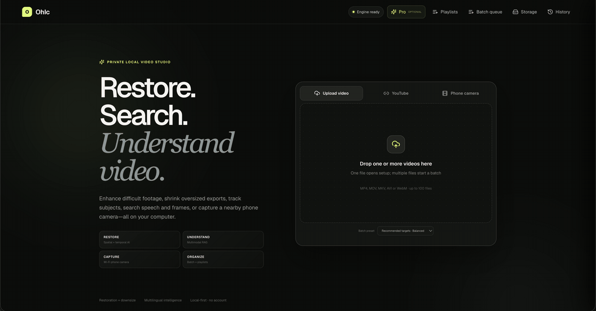
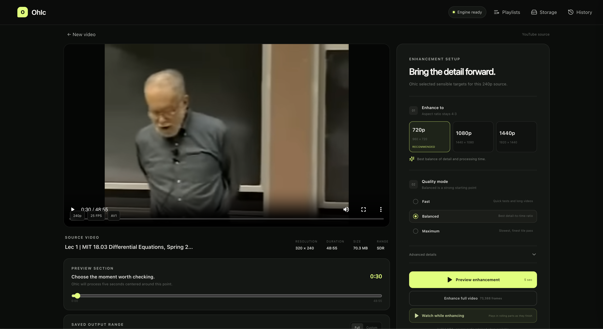
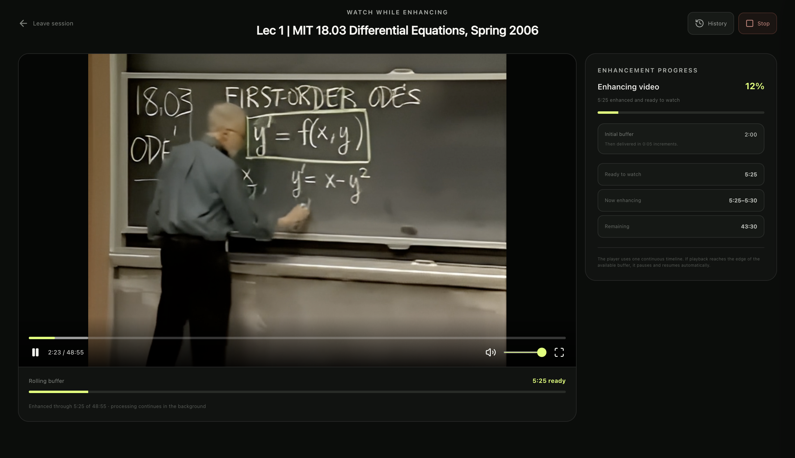

# OhIc (Oh-I-See 😉)

[**Visit the OhIc website**](https://ravi0531rp.github.io/OhIc/) · See what it can do, how privacy works, and how to get started.

[**Download the native macOS app · Apple silicon · macOS 13+**](https://github.com/ravi0531rp/OhIc/releases/download/native-macos-preview/OhIc-macOS-Apple-Silicon.dmg)

_Rolling test build produced only after CI and mounted-app smoke tests pass. Because this preview is
not yet Apple-notarized, Control-click **OhIc** in Applications and choose **Open** on first launch._

**Restore, search, understand, and capture private video.**

OhIc is a free, open-source local video studio. Restore or downsize an import, inspect it with
multilingual transcription and object tracking, ask evidence-grounded questions over transcript
or visual embeddings, or pair a phone camera on the same Wi-Fi network. Video processing and AI
inference stay on the computer.

This README is for people using OhIc. If you are installing it for development, changing the
code, integrating the API, or tuning its configuration, see the
**[Developer README](DEVELOPER_README.md)**.

## Interface preview

<p align="center">
  
</p>

<p align="center"><sub>Import a video, analyze speech and subjects locally, then search it with timestamp-grounded AI.</sub></p>

After setup:

1. Open an imported video and choose **Pro**, then **Analyze this video**.
2. Choose multilingual Whisper or Tara for Hindi/Hinglish code-switching, select a language hint,
   and decide whether to track people, common objects, or both. RF-DETR Small detects subjects and
   ByteTrack follows them through the clip. The original video is never modified.
3. Turn captions on in the player, search the transcript, or choose any timestamp to seek there.
4. Open **Subjects** to see appearance windows. Give a person a name or link the track to a name
   you assigned earlier. OhIc remembers that label in its local identity vault; it does not guess
   real-world identity or run cloud face recognition.
5. Open **Ask**, choose Transcript, Video, or both retrieval indexes, and ask about speech, people,
   objects, visible moments, or the current playhead. OhIc runs read-only retrieval tools over
   multilingual transcript embeddings, CLIP video-frame embeddings, tracked appearances, and
   metadata before Qwen writes the answer. Answers include clickable evidence timestamps, and the
   interface shows which local tools were used.


<p align="center">
  
</p>

<p align="center"><sub>The enhancement workspace after importing a video.</sub></p>

## What you can do

- Import local MP4, MOV, MKV, AVI, WebM, and M4V files.
- Inspect and download a permitted YouTube video with visible download percentage, speed, size,
  ETA, retry status, and a stop button.
- Import a YouTube playlist, select exactly which videos to process, and follow every item from
  download through enhancement. All videos are selected by default.
- Review resolution, frame rate, duration, file size, codec, aspect ratio, and SDR/HDR detection
  before processing.
- Get a plain-language source diagnosis and apply its recommended enhancement recipe.
- Choose an aspect-safe recommended output such as 720p, 1080p, 1440p, or 4K.
- Reduce an oversized source to a smaller standard resolution with a non-generative Lanczos pass.
- Choose fast frame-by-frame Real-ESRGAN or experimental, temporally aware RealBasicVSR for
  supported videos.
- Pick **Fast**, **Balanced**, or **Maximum** quality.
- Test the exact enhancement pipeline on a five-second preview.
- Open Preview Lab to compare the original with Fast, Balanced, and Maximum passes at once.
- Enhance the full video or save only a custom start-to-end range.
- Watch an enhanced video before the entire job finishes with adaptive, independently playable
  parts.
- Follow real enhancement progress, including stage, frames processed, processing FPS, elapsed
  time, and ETA.
- Leave an active session and reopen it from History without losing the chosen resolution,
  quality preset, preview point, range, or live progress.
- Pause and resume queued or running enhancements safely. After a restart, interrupted work is
  recovered as paused and completed checkpoints are reused.
- Upload up to 100 local videos into a persistent batch queue and reuse named presets.
- Auto-detect interlaced sources, use motion-adaptive deinterlacing, or restore film cadence with
  inverse telecine on compatible 29.97/30 FPS sources.
- Let adaptive resource management select safe tile and temporal-window sizes, or choose a
  Conservative/Performance policy and a memory ceiling.
- Preserve multiple audio tracks, subtitles, attachments, chapters, and metadata in MKV exports.
- Stop queued or running downloads, enhancements, local batches, and playlist batches.
- Compare original and enhanced video with a draggable wipe or side-by-side view, synchronized
  playback, zoom, and frame stepping.
- Pair a phone on the same Wi-Fi network with a one-time QR code and turn its camera stream into
  an imported clip. The pairing page uses the phone's native camera recorder over local HTTP and
  offers live browser streaming when the origin has secure camera access.
- Select and delete saved uploads, YouTube downloads, results, previews, and streaming parts from
  the Storage panel.
- Move the selected video between Restore and **Pro Intelligence** without importing it again.
- Optionally add **Pro Intelligence** for multilingual Whisper or Hindi/Hinglish Tara subtitles,
  RF-DETR Small detection with ByteTrack subject tracking, remembered user-assigned names,
  separate transcript/video embedding search, and timestamp-grounded multimodal chat.

## Privacy and network use

Normal video uploads and AI processing happen on your computer. OhIc has no account system,
analytics, telemetry, or cloud video-processing service. Its local database contains metadata and
file locations—not copies of your video bytes.

Network access is used only when you ask OhIc to:

- inspect or download a YouTube video or playlist; or
- pair with a phone camera over the local network; or
- download an official enhancement model the first time you select its engine; or
- download the optional Pro Intelligence bundle after you explicitly choose **Download Pro**.

Pro Intelligence is not part of the normal installation and downloads nothing in the background.
On Apple silicon it uses an MLX-optimized Qwen3-VL 4B model and Whisper large-v3 turbo. Other
supported systems use a smaller portable Qwen model and a local faster-whisper runtime. Tara adds
Hindi/Hinglish code-switch transcription; RF-DETR Small and ByteTrack add object detection and
tracking; multilingual sentence and CLIP indexes power retrieval. The bundle is stored inside
OhIc's data directory and never uploads a video, transcript, identity, frame, or question to a
model service.

Use YouTube features only for videos you own or are permitted to download and process.

## Requirements

- The native DMG supports Apple silicon Macs on macOS 13 or newer. It includes Python, Node.js,
  FFmpeg, FFprobe, uv, and every core application library; Homebrew and developer tools are not
  required on the destination Mac.
- Source installations support macOS 13 or newer and Linux.
- OhIc uses MPS or CUDA acceleration when available and falls back to CPU processing.
- Building from source requires Python 3.11 or 3.12 managed through
  [uv](https://docs.astral.sh/uv/), Node.js 22.13 or newer, and FFmpeg including FFprobe.
- At least about 500 MB for application dependencies, plus roughly 67 MB for Real-ESRGAN or
  141 MB for the optional RealBasicVSR checkpoint.
- If you enable Pro Intelligence, allow roughly 10.5 GB on Apple silicon or 12.5 GB for the
  portable runtime and models. More free memory improves video-chat response time.
- Enough free disk space for the imported source, temporary processing data, streaming parts, and
  final result. Long or high-resolution videos can require several times the source file size.

CPU enhancement works, but it can be very slow. Supported hardware acceleration is strongly
recommended for longer videos.

## Install and start

On macOS or Linux, this one command downloads OhIc, installs missing prerequisites, creates its
isolated environment, builds the interface, verifies the installation, starts the app, and opens
it in your browser:

```bash
curl -fsSL https://raw.githubusercontent.com/ravi0531rp/OhIc/main/install.sh | bash
```

FFmpeg is installed through the computer's package manager, so the first installation may request
your administrator password. OhIc and its other tools stay in your user-data directory. Keep the
Terminal window running while you use OhIc; press `Control-C` to stop it.

After installation, start it again from any directory with:

```bash
ohic
```

Use `ohic --update` to install the latest version or `ohic --doctor` to check the local tools.
The manual repository setup remains available in the
[developer guide](DEVELOPER_README.md#setup-from-a-fresh-clone).

The first run with an engine downloads its official checkpoint. Validated models are cached
locally for later jobs.

For platform-specific setup, manual commands, Docker, or non-default ports, follow the
[complete developer setup](DEVELOPER_README.md#setup-from-a-fresh-clone).

## Enhance one video

1. Open OhIc and choose **Local file** or **YouTube**.
2. Drop or browse to a local video. For YouTube, paste a single-video link, inspect it, confirm it
   is the correct video, and start the download.
3. Review the detected source details and choose an AI engine. **Real-ESRGAN ×2** is the reliable
   default. **RealBasicVSR ×4** is an experimental temporal option for sources up to 720p; it can
   reduce frame-to-frame flicker but needs substantially more memory and processing time.
4. Select an output resolution. OhIc marks a sensible target as **Recommended** and always
   preserves the source aspect ratio.
5. Choose a quality mode:

   - **Fast** is best for quick checks and long videos.
   - **Balanced** is the recommended detail-to-time tradeoff.
   - **Maximum** uses the slowest, finest pass and the highest output quality setting.

6. Move the preview marker to a representative moment and run the five-second preview.
7. Inspect the preview in the comparison viewer. You can drag the before/after divider, switch to
   side by side, zoom, pause, and use the arrow keys or frame buttons.
8. Return to the workspace and choose one of the full actions:

   - **Enhance full video** waits for one complete downloadable result.
   - **Enhance selected range** processes and saves only your chosen timestamps.
   - **Watch while enhancing** starts playback as soon as the first enhanced part is ready.

9. Download the completed MP4, or enable **Preserve every media track** for an archival MKV.

RealBasicVSR supports previews, complete videos, custom timestamp ranges, crash-safe checkpoints,
adaptive temporal windows, and scene-cut-aware context. It does not yet support **Watch while
enhancing**, playlists, or sources above 720p. OhIc disables unsupported actions instead of
silently switching the engine.

### Diagnose, deinterlace, and preserve the source

After import, **Source diagnosis** explains likely low resolution, compression, interlacing, low
frame rate, or HDR concerns. **Apply recipe** selects a conservative target, engine, quality, and
scan treatment. Advanced details let you override scan treatment and resource policy.

Browser-compatible MP4 exports retain all audio tracks plus chapters and metadata. Enable
**Preserve every media track** for MKV, which copies compatible audio, subtitle, attachment, data,
chapter, and container metadata streams without converting them. The enhanced video stream remains
H.264.

### Compare several previews

Choose **Compare Fast · Balanced · Maximum** to open Preview Lab. OhIc runs the same five-second
moment through three linked jobs and shows them beside the original as each becomes ready. Preview
Lab sessions and their jobs are stored locally, so their results remain available in History.

### Queue local files and save presets

Select or drop several files at once to create a local batch. Choose a built-in quality or a named
preset before import. Open **Batch queue** to pause, resume, stop, inspect progress, or open a
completed item. In any single-video workspace, Advanced details can save the current target,
engine, quality, container, scan, scene, and resource settings as a reusable preset.

### Select only part of a video

The saved output defaults to the full source. Switch **Saved output range** from **Full** to
**Custom**, then choose the start and end. You can move the source player to an exact moment and
use **Use playhead** for either boundary. The selection must be at least 0.1 seconds long.

The preview marker is separate from the saved-output range: it controls which five seconds are
used for a preview, while the custom range controls the final or watch-while-enhancing output.

## Enhance a YouTube playlist

1. Open **YouTube**, switch from **Single video** to **Playlist**, and paste the playlist URL.
2. Inspect the playlist. OhIc lists up to 100 available videos and selects all of them by default.
3. Clear individual videos, use **Clear** to start over, or use **Select all** to restore the full
   selection.
4. Choose Fast, Balanced, or Maximum quality and start the playlist.
5. Open **Playlists** at any time to see the saved batch, its overall progress, and the stage and
   result for each video.

Playlist videos are processed sequentially to protect local memory. Each selected video is
downloaded, assigned its recommended output resolution, enhanced, and saved. The playlist remains
available when you move to another enhancement session or reopen the app. You can stop an active
batch, open completed items, or remove a finished playlist record. Removing the playlist record
does not delete its local videos; use **Storage** for that.

## Watch while enhancing

This mode divides the chosen full video or custom range into independently playable parts. For a
selection of at least two minutes, the first part is two minutes. For a selection from one minute
to under two minutes, the first part is one minute. Selections under one minute use five-second
parts throughout. After any larger first part, every later part is at most five seconds.

Each part becomes playable as soon as it finishes. OhIc advances to the next ready part
automatically behind one continuous full-duration player and timeline; internal part boundaries are
not exposed as separate videos. You can seek anywhere in the enhanced range that is already
buffered. If playback catches up with processing, it pauses at the buffer edge and resumes when
more video is available. You can leave the viewer and reopen it from **History** without losing the
rolling buffer. When processing finishes, OhIc joins the internal parts into one downloadable MP4.

<p align="center">
  
</p>

<p align="center"><sub>Watch the enhanced portion on one continuous timeline while the ready buffer grows in the background.</sub></p>

This design front-loads the main wait and reduces the chance of later pauses. It cannot make
enhancement run in real time, so a demanding upscale can still reach a part boundary before the
next part is ready.

## Understand a video with Pro Intelligence

Choose **Pro** in the top navigation. The first screen explains the local models and their disk
size. Nothing is installed until you choose **Download Pro**; an interrupted download can be
resumed.

## macOS disk image

Every successful backend and frontend CI run builds a versioned `OhIc-*.dmg` on macOS, mounts and
smoke-tests its bundled Python, Node, FFmpeg, and `uv` runtimes, then uploads the disk image to the
GitHub Actions run for 30 days. Successful pushes to the native-app branch or `main` also replace
the rolling `native-macos-preview` prerelease asset linked at the top of this README. Local macOS
builds use `scripts/build-dmg.sh`; the generated `release/` directory is intentionally ignored by Git.

The disk image contains a native macOS application. Drag **OhIc** to **Applications** and open it
like any other app; its existing interface runs inside an OhIc window rather than opening a browser.
The app starts and stops its private local services with the window, while file selection,
downloads, confirmation prompts, and keyboard shortcuts use standard macOS controls.

Analyses, identity labels, and chats persist when you change sessions or restart OhIc. Open Pro
without a selected source to see the persistent analysis library. **Release AI memory** unloads
Qwen from working memory without removing its downloaded files or saved analysis.

Automatic tracking is a navigation aid, not biometric identification or forensic evidence. It can
miss distant, obscured, animated, or poorly lit people and may split one person into several
tracks. Likewise, local model answers can be incomplete; use the timestamp citations to inspect
the source yourself.

## Track, reopen, and stop work

The top navigation provides four persistent views:

- **History** lists preview, full-video, custom-range, playlist, and watch-while-enhancing jobs.
  Open any row to return to the exact session. Active rows show **View live** and a **Stop** button.
- **Playlists** preserves playlist batches and each selected video's state.
- **Batch queue** preserves local multi-file batches and group controls.
- **Storage** lists the local files managed by OhIc and their disk usage.

Only one enhancement runs at a time. Additional jobs wait in the queue. Stopping a queued job
prevents it from starting; stopping a running job terminates its active media processes and removes
its incomplete final output. Already playable streaming parts may remain until you delete them
from Storage.

History, local batches, presets, Preview Labs, and playlist metadata survive app restarts. If the
engine or computer stops during enhancement, OhIc marks the interrupted job **Recovered after
restart**. Resume it from History: full-video jobs reuse verified 30-second checkpoints,
watch-while-enhancing jobs reuse ready parts, and short previews restart safely.

## Manage local storage

Open **Storage**, select one or more inactive items, review their combined size, and choose
**Delete selected**. Active sources and outputs are locked until their jobs are stopped.

Deleting a source also removes its linked results and History records. Deleting an output removes
that job's result, preview comparison file, and any watch-while-enhancing parts. Deletion is
permanent, so download or copy anything you want to keep first.

By default, OhIc stores its working data in the repository's `data` folder.

## Understanding the result

OhIc's AI engines synthesize plausible visual detail and then size the frame exactly for the chosen
output. They can make many low-resolution or compressed videos look clearer, but cannot recover
facts that are absent from the source. Do not treat reconstructed faces, text, license plates, or
objects as forensic evidence.

Real-ESRGAN enhances frames independently, so difficult motion, grain, flashing detail, or heavy
compression can shimmer. RealBasicVSR considers nearby frames, but may instead produce motion
smear, ghosting, or unstable detail. Always use a representative preview before a long job.

## Troubleshooting

### “OhIc's local engine is not running”

Make sure `./scripts/start.sh` is still running in Terminal. If it stopped, run it again from the
OhIc folder, then refresh the browser. The health page at
[http://localhost:8000/api/health](http://localhost:8000/api/health) should report FFmpeg,
FFprobe, and the detected accelerator.

### FFmpeg or FFprobe is missing

Install FFmpeg and restart OhIc:

```bash
brew install ffmpeg
```

### A YouTube video will not download

Confirm that the video is public, available in your region, and permitted for you to download.
Then update the backend dependencies and retry:

```bash
cd backend
uv lock --upgrade-package yt-dlp
uv sync --group dev
cd ..
./scripts/start.sh
```

Open **YouTube Reliability Center** in the YouTube importer to verify yt-dlp, Node.js challenge
support, cookies configuration, and optional PO-token-provider availability. Failed downloads show
a machine-readable failure category and recovery steps. OhIc automatically tries several
compatible formats and abandons unusably throttled streams instead of appearing stuck.

### The first enhancement cannot download the AI model

Check the internet connection and retry. A partial or invalid model is discarded automatically.
The next job downloads a clean copy.

### Enhancement runs out of memory

Try a lower target resolution or Fast/Balanced quality. OhIc automatically retries once with
smaller tiles, but very large frames can still exceed available GPU or unified memory.

### Processing is slower than expected

Real-ESRGAN evaluates every frame. Start with a five-second preview, use the recommended target,
and choose Fast. CPU processing can be much slower than playback speed; use supported hardware
acceleration when available.

### A result disappeared

The source or output may have been removed in Storage or outside OhIc. The app keeps metadata and
media files separately, so moving or deleting managed files manually can leave an unavailable
History entry.

More diagnostics—including ports, CORS, logs, live YouTube tests, model cache recovery, and data
inspection—are in the [developer troubleshooting guide](DEVELOPER_README.md#troubleshooting).

## Current limitations

- Enhanced output video is H.264. MP4 transcodes audio to AAC for compatibility; MKV archive mode
  copies source media tracks but browser playback support varies, so it is primarily a download.
- HDR sources are detected, but enhancement currently passes through an 8-bit RGB pipeline and
  produces SDR output.
- RealBasicVSR is experimental, limited to 720p input, and unavailable for playlists and
  watch-while-enhancing.
- Playlist imports are limited to the first 100 available entries and use each video's recommended
  resolution; per-item resolution and timestamp ranges are not currently configurable.
- The app does not collect YouTube credentials. Cookies are an optional developer configuration,
  and PO-token providers are installed separately when a source requires them.
- Checkpoint files increase temporary output storage until a completed or cancelled job is cleaned
  from Storage.
- Only one enhancement, one standalone YouTube download, and one playlist workflow are dispatched
  at a time in their respective queues. They can still contend for disk, network, and CPU.

## Documentation and license

- [Developer README](DEVELOPER_README.md)—complete setup, configuration, architecture, API,
  pipeline, persistence, tests, Docker, and contribution guide
- [Architecture notes](docs/architecture.md)—short architectural overview
- [Model evaluation](docs/model-evaluation.md)—why Real-ESRGAN ×2 was selected
- [RealBasicVSR experiment](docs/realbasicvsr-experiment.md)—temporal engine status and limits
- [Third-party notices](THIRD_PARTY_NOTICES.md)—upstream software and model licensing

OhIc is licensed under the [MIT License](LICENSE). Third-party software and model weights retain
their own licenses.
